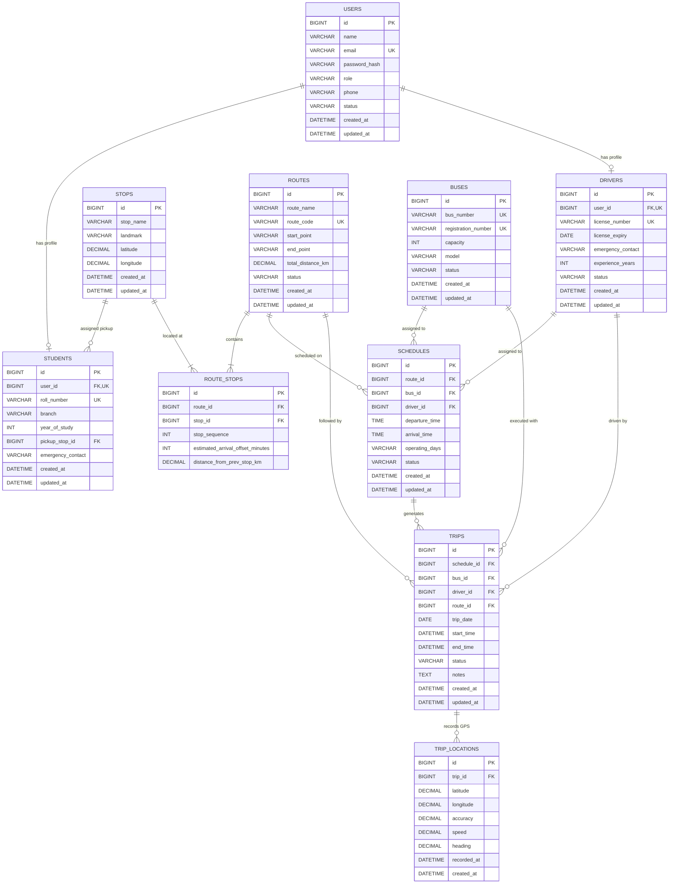

# SmartBus — Entity Relationship (ER) Diagram

## 1. Complete Entity-Relationship Model

The following Mermaid diagram visualizes the entities, primary keys (PK), foreign keys (FK), core attributes, and relational cardinalities in the SmartBus database:

---

## 2. Key Relationship Explanations

1. **`USERS` ↔ `STUDENTS` & `DRIVERS` (1 : 0..1)**
   - Every student or driver is anchored to a unique `user_id` authentication identity.
   - Admin accounts reside purely in `USERS` without requiring profile extensions.

2. **`ROUTES` ↔ `ROUTE_STOPS` ↔ `STOPS` (Many-to-Many via Junction)**
   - A single physical stop (e.g. "Main Junction") can be part of multiple college bus routes.
   - `ROUTE_STOPS` defines the strict topological order (`stop_sequence`) and time offsets for each route independently.

3. **`SCHEDULES` ↔ `TRIPS` (1 : N Template to Instance)**
   - A `SCHEDULE` defines recurring operational plans (e.g., Weekday Morning Route 2).
   - Each individual bus journey conducted by a driver is recorded as an independent `TRIP` record.

4. **`TRIPS` ↔ `TRIP_LOCATIONS` (1 : N Real-Time Stream)**
   - As a driver executes a trip, periodic GPS fixes are stored sequentially in `TRIP_LOCATIONS`.
   - Indexing on `(trip_id, recorded_at DESC)` ensures instant retrieval of the bus marker's current coordinate.
